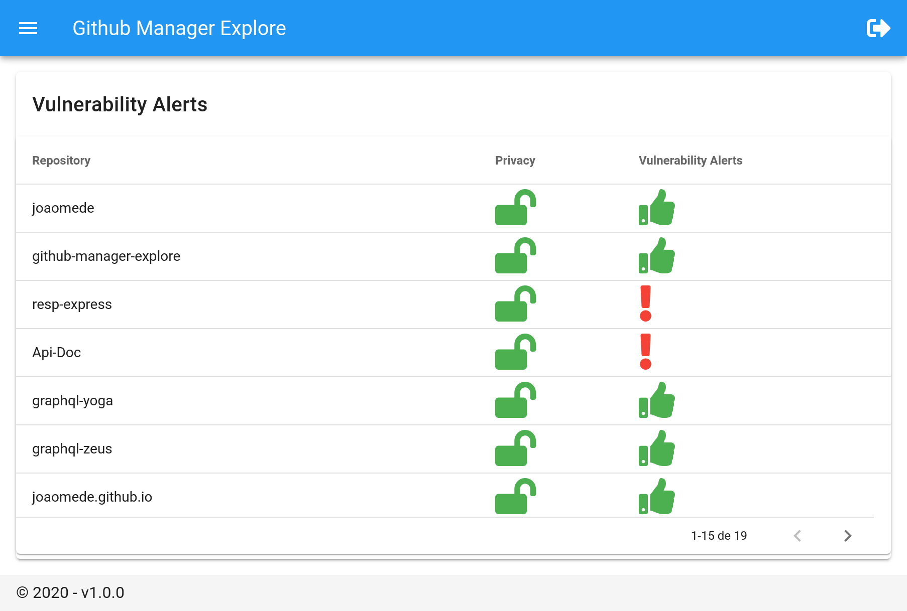
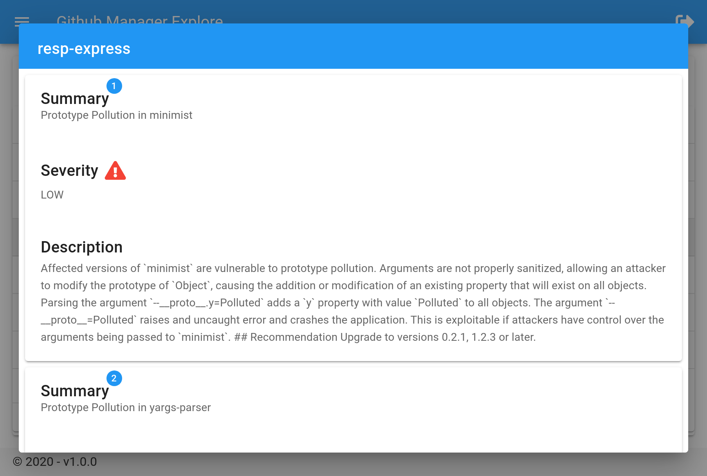

# Github Manager Explore

> ! This project uses the Github GRAPH V4 API to display the information, so a personal access token generated on GitHub is required, ["Tutorial to creating Personal Token"](https://docs.github.com/en/github/authenticating-to-github/creating-a-personal-access-token)

## About Project

> This project is a functional example Vuejs 2.x with Vuetify UI, I used the Composition API with typescript and also JSX / TSX transpiler like
["babel-preset-vca-jsx"](https://github.com/luwanquan/babel-preset-vca-jsx), thank you very much for the developer for that!

## Features
[x] Personal Token Login
[x] Vulnerability Alerts (list and view)

## Images

@MIT